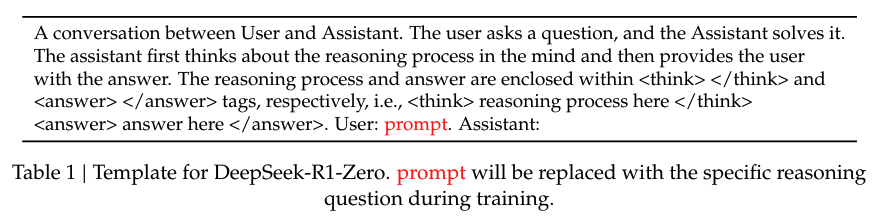

# Core intuition of GRPO
### 🥅 **Goal:**
GRPO directly evaluates the model-generated responses by comparing them within groups of generation to optimize policy model, instead of training a seperate value model (Critic). This approach leads to significant reduction in computational cost!

### 📱**Application**: 
Mostly in verifiable domains like Math reasoning or/and code generation that requires clear reward rules cause the original deepseek-r1 model that uses grpo, has a set of rule-based reward scenario where there are defined rules for the desired output (e.g. in case of math, there is clear correct answer). 

# Steps of GRPO
## 🐾 Step 1) **Group Sampling**:
### **Action:** 
For each question $q$, the model will generate $G$ outputs (group size) from the old policy model:{ ${o_1, o_2, o_3, \dots, o_G}\pi_{\theta_{\text{old}}}$ }, $G=8$ where each $o_i$ represents one completion from the model.
### **Example**:
- **Question** 
	- $q$ : $\text{Calculate}\space2 + 2 \times 6$
- **Output**: we will have $8$ responses; $(G = 8)$	$${o_1:14(correct), o_2:10 (wrong), o_3:16 (wrong), ... o_G:14(correct)}$$
## 🐾 Step 2) **Advantage Calculation**:
### **Reward Distribution:**
Assign a RM score to each of the generated responses based on the correctness $r_i$ *(e.g. 1 for correct response, 0 for wrong response)* then for each of the $r_i$ calculate the following Advantage value 
### **Advantage Value Formula**:
$$A_i = \frac{r_i - \text{mean}(\{r_1, r_2, \ldots, r_G\})}{\text{std}(\{r_1, r_2, \ldots, r_G\})}$$
### **Example**:
for the same example above, imagine we have 8 responses, 4 of which is correct and the rest wrong, therefore;
- Group Average: $mean(r_i) = 0.5$
- Std: $std(r_i) = 0.53$
- Advantage Value:
	- Correct response: $A_i = \frac{1 - 0.5}{0.53}= 0.94$
	- Wrong response: $A_i = \frac{0 - 0.5}{0.53}= -0.94$
### **Meaning**:  
- This standardization (i.e. $A_i$ weighting) allows the model to assess each response's relative performance, guiding the optimization process to favour responses that are better than average (high reward) and discourage those that are worse.  For instance if $A_i > 0$, then the $o_i$ is better response than the average level within it's group; and if if $A_i < 0$, then the $o_i$ then the quality of the response is less than the average (i.e. poor quality/performance). 
- For the example above, if $A_i = 0.94 \text{(correct output)}$ then during optimization steps its generation probability will be increased. 
## 🐾 Step 3) **Policy Update; Target Function:** 
$$J_{GRPO}(\theta) = \left[\frac{1}{G} \sum_{i=1}^{G} \min \left( \frac{\pi_{\theta}(o_i|q)}{\pi_{\theta_{old}}(o_i|q)} A_i \text{clip}\left( \frac{\pi_{\theta}(o_i|q)}{\pi_{\theta_{old}}(o_i|q)}, 1 - \epsilon, 1 + \epsilon \right) A_i \right)\right]- \beta D_{KL}(\pi_{\theta} || \pi_{ref})$$

## 🔑 **Key Components of the Target function**:
## 📊 **1. Probability Ratio:** $\left(\frac{\pi_{\theta}(o_i|q)}{\pi_{\theta_{old}}(o_i|q)}\right)$ 
Intuitively, the formula compares how much the new model's response probability differs from the old model's response probability while incorporating a preference for responses that improve the expected outcome.
### **Meaning**:
- If $\text{ratio} > 1$, the new model assigns a higher probability to response $o_i$​ than the old model.
- If $\text{ratio} < 1$, the new model assigns a lower probability to $o_i$​ 
## **2. ✂️ Clip Function:** $\text{clip}\left( \frac{\pi_{\theta}(o_i|q)}{\pi_{\theta_{old}}(o_i|q)}, 1 - \epsilon, 1 + \epsilon\right)$ 
Limit the ratio discussed above to be within $[1 - \epsilon, 1 + \epsilon]$ to avoid/control drastic changes or crazy updates and stepping too far off from the old policy. In other words, it limit how much the probability ratio can increase to help maintaining stability by avoiding updates that push the new model too far from the old one.
### **Example** $\space \text{suppose}(\epsilon = 0.2)$
- **Case 1**: if the new policy has a probability of 0.9 for a specific response and the old policy has a probabiliy of 0.5, it means this response is getting reiforeced by the new policy to have higher probability, but within a controlled limit which is the clipping to tight up its hands to not get drastic 
	- $\text{Ratio}: \frac{\pi_{\theta}(o_i|q)}{\pi_{\theta_{old}}(o_i|q)} = \frac{0.9}{0.5} = 1.8  → \text{Clip}\space1.2$ (upper bound limit 1.2) 
- **Case 2**: If the new policy is not in favour of a response (lower probability e.g. 0.2), meaning if the response is not beneficial the increase might be incorrect, and the model would be penalized.
	- $\text{Ratio}: \frac{\pi_{\theta}(o_i|q)}{\pi_{\theta_{old}}(o_i|q)} = \frac{0.2}{0.5} = 0.4  →\text{Clip}\space0.8$ (lower bound limit 0.8)
### **Meaning**:
- The formula encourages the new model to favour responses that the old model underweighted **if they improve the outcome**.
- If the old model already favoured a response with a high probability, the new model can still reinforce it **but only within a controlled limit $[1 - \epsilon, 1 + \epsilon]$, $\text{(e.g., }\epsilon = 0.2, \space \text{so} \space [0.8-1.2])$**.
- If the old model overestimated a response that performs poorly, the new model is **discouraged** from maintaining that high probability.
- Therefore, intuitively, By incorporating the probability ratio, the objective function ensures that updates to the policy are proportional to the advantage $A_i$ while being moderated to prevent drastic changes. T

## **3. 🚩 KL Divergence:**  $\beta D_{KL}(\pi_{\theta} || \pi_{ref})$
KL Divergence is used to prevent over-optimization of the reward model, which in this context is refers to when the model output non-sensical text or in our math reasoning example, the model will generate extremely incorrect answers!
### **Example**
Suppose the reward model has a flaw—it **wrongly assigns higher rewards to incorrect outputs** due to spurious correlations in the training data. So,  $2 + 2 \times 6 = 20$ then later the Ratio $R(o_6​=20)=0.95$ *(wrong but rewarded highly)*, without KL Divergence, during optimization, the model will learn to favours responses that are higher numbers, assuming they indicate *"more confident"* reasoning, i.e. the model starts shifting its policy towards these outputs. And future iterations reinforce these incorrect answers. So, say  $2 + 2 \times 6 = 42 \space \text{(a random common number in datasets)}$. This response doesn't even resemble arithmetic errors anymore. Instead, the model has learned to exploit whatever patterns maximize the reward signal, regardless of correctness. 
### **Meaning**
- A KL divergence penalty keeps the model’s outputs close to its original distribution, preventing extreme shifts.
- Even if incorrect answers receive high rewards, the model cannot deviate too much from what it originally considered reasonable.
- Instead of drifting towards completely irrational outputs, the model would refine its understanding while still allowing some exploration
-  The 
### **Math Definition**
Recall that KL distance is defined as follows:
$$D_{KL}(P || Q) = \sum_{x \in X} P(x) \log \frac{P(x)}{Q(x)}$$
In RLHF, the two distributions of interest are often the distribution of the new model version, P(x), and a distribution of the reference policy, Q(x).
### **Term** $\beta \space$ in $\beta D_{KL}(\pi_{\theta} || \pi_{ref})$
-  **Higher $\beta$ (Stronger KL Penalty)**
    - More constraint on policy updates. The model remains close to its reference distribution.
    - Can slow down adaptation: The model may struggle to explore better responses.
- **Lower $\beta$ (Weaker KL Penalty)**
    - More freedom to update policy: The model can deviate more from the reference.
    - Faster adaptation but risk of instability: The model might learn reward-hacking behaviors.
	- Over-optimization risk: If the reward model is flawed, the policy might generate nonsensical outputs.
- **Original** [DeepSeekMath](https://arxiv.org/abs/2402.03300) paper set this $\beta= 0.04$

Below is the picture of the GRPO algorithm in a nutshell:


# 🧮 Complete Simple Math Example
## **Question** 
$$\text{Q: Calculate}\space2 + 2 \times 6$$

## **Step 1) Group Sampling**
Generate $(G = 8)$ responses, $4$ of which are correct answer ($14, \text{reward=} 1$) and $4$ incorrect $\text{(reward= 0)}$, Therefore:

$${o_1:14(correct), o_2:10 (wrong), o_3:16 (wrong), ... o_G:14(correct)}$$
## **Step 2) Advantage Calculation**
- Group Average: 
$$mean(r_i) = 0.5$$
- Std: $$std(r_i) = 0.53$$
- Advantage Value:
	- Correct response: $A_i = \frac{1 - 0.5}{0.53}= 0.94$
	- Wrong response: $A_i = \frac{0 - 0.5}{0.53}= -0.94$
## **Step 3) Policy Update**
- Assuming the probability of old policy ($\pi_{\theta_{old}}$) for a correct output $o_1$ is $0.5$ and the new policy increases it to $0.7$ then:
$$\text{Ratio}: \frac{0.7}{0.5} = 1.4  →\text{after Clip}\space1.2 \space (\epsilon = 0.2)$$
- Then when the target function is re-weighted, the model tends to reinforce the generation of correct output, and the $\text{KL Divergence}$  limits the deviation from the reference policy. 

# 💻 Complere Code Example
As discussed above, the GRPO algorithm involves three main steps:
1. Group Sampling: Generate multiple responses for each question. Then evaluate the responses based on the reward model (reward scoring).
	-  This reward model can be:
		- A Simple rule-based reward model that assigns rewards based on the correctness of the response.
		- An NN-based network reward model that can be trained to assign rewards based on the correctness of the response.
2. Advantage Calculation: Calculate the advantage value for each response.
3. Policy Update: Update the policy model based on the advantage values.

## 📝 Note on Reward Model
- The reward model can be a simple rule-based model that assigns rewards based on the correctness of the response.
- Alternatively, it can be an NN-based network reward model that can be trained to assign rewards based on the correctness of the response.
-Currently TRL supports all combinations of reward models, including rule-based reward models and NN-based reward models, mixed of both, or even the scenario that we have reward model for *some* of the samples in the dataset and not for others (Multi-task reward model). This flexibility allows the user to choose the most suitable reward model for their specific task. For example, imagine a scenario where the user has a dataset of mixed promts like math reasoning, code generation, and text generation. However, the user has only a rule-based reward model for math reasoning and **NOT** for code generation. In this case, the user can use a Multi-task reward model schema supported in TRL free of stress for crash because of a missing reward model for code generation. But Note that we always need to have at least one corresponding reward model for the samples in the dataset. 

# 🐍 Example of Multi-task rule-based reward model
```python

def format_reward_func(completions, target, **kwargs):
    """
    Evaluates completions based solely on correct format:
    Format: <think>...</think><answer>...</answer>
    """
    rewards = []
    for completion in completions:
        try:
            completion = "<think>" + completion if not completion.startswith("<think>") else completion
            regex = r"^<think>([^<]*(?:<(?!/?think>)[^<]*)*)<\/think>\n<answer>([\s\S]*?)<\/answer>$"
            match = re.search(regex, completion, re.DOTALL)
            if match is None or len(match.groups()) != 2:
                rewards.append(0.0)
            else:
                rewards.append(1.0)
        except Exception:
            rewards.append(0.0)
    return rewards

def simple_math_reward_func(completions, target, nums, **kwargs):
    """
    Evaluates completions based on:
    1. Correct format: <think>...</think><answer>...</answer>
    2. Uses numbers from the provided set (subset allowed)
    3. Evaluates to the target value
    """
    rewards = []
    for completion, gt, numbers in zip(completions, target, nums):
        try:
            # Enforce full format
            completion = "<think>" + completion if not completion.startswith("<think>") else completion
            regex = r"^<think>([^<]*(?:<(?!/?think>)[^<]*)*)<\/think>\n<answer>([\s\S]*?)<\/answer>$"
            match = re.search(regex, completion, re.DOTALL)
            if match is None or len(match.groups()) != 2:
                rewards.append(0.0)
                continue
                
            equation = match.group(2).strip()
            used_numbers = [int(n) for n in re.findall(r'\d+', equation)]
            
            # Check if all used numbers are in the provided set (subset allowed)
            if not all(num in numbers for num in used_numbers):
                rewards.append(0.0)
                continue
                
            # Check for allowed characters only
            allowed_pattern = r'^[\d+\-*/().\s]+$'
            if not re.match(allowed_pattern, equation):
                rewards.append(0.0)
                continue
                
            # Evaluate the equation safely
            result = eval(equation, {"__builtins__": None}, {})
            if abs(float(result) - float(gt)) < 1e-5:
                rewards.append(1.0)
            else:
                rewards.append(0.0)
        except Exception:
            rewards.append(0.0)
    return rewards
def code_reward_func(completions, **kwargs):
    """
    Evaluates the correctness of code snippets inside <code>...</code>.

    Args:
        completions (list[str]): Generated outputs
    
    Returns:
        list[float]: Reward scores
    """
    rewards = []
    
    for completion in completions:
        try:
            match = re.search(r"<code>([\s\S]+?)<\/code>", completion)
            if match is None:
                rewards.append(0.0)
                continue

            code = match.group(1).strip()

            # Check for disallowed imports and unsafe execution patterns
            if re.search(r"\b(import|exec|eval|open|os|sys|subprocess)\b", code):
                rewards.append(0.0)
                continue

            # Validate syntax using AST (Abstract Syntax Tree)
            try:
                ast.parse(code)
            except SyntaxError:
                rewards.append(0.3)  # Partial reward for format but incorrect syntax
                continue

            rewards.append(1.0)  # Fully correct if it passes format and syntax checks

        except Exception:
            rewards.append(0.0)  # Fail-safe
        
    return rewards
```
Note: `<think>` is synthetically added to each of the prompt by us as discussed in the original deepseek papar. 



We can simply test the above functions by;
```python
correct_sample_3 = """Let's use the numbers 4, 8, 2, and 1 to get 15. 
We can try: 8 * 2 - 1 = 15... </think>
<answer> 8 * 2 - 1 </answer>"""

correct_sample_4 = """ ... </think>
<answer> 8 * 2 - 1 </answer>"""

wrong_format_3 = """Using 4, 8, 2, 1, make 15: 8 * 2 - 1 = 15"""

wrong_format_4 = """<answer> 8 + 4 + 2 + 1 </answer>
<think> This should equal 15 </think>"""

wrong_result_2 = """ ... </think>
<answer> 8 + 4 - 2 </answer>"""

wrong_numbers = """ ... </think>
<answer> 10 * 2 - 5 </answer>"""

# Test setup
test_completions = [
    correct_sample_3,
    correct_sample_4,
    wrong_format_3,
    wrong_format_4,
    wrong_result_2,
    wrong_numbers
]
test_target = ["15"] * 6
test_nums = [[4, 8, 2, 1]] * 6

# Run tests
format_rewards = format_reward_func(test_completions, test_target)
print("Format rewards:", format_rewards)
assert format_rewards == [1.0, 1.0, 0.0, 0.0, 1.0, 1.0], "Format reward function is not working"

math_rewards = simple_math_reward_func(test_completions, test_target, nums=test_nums)
print("Math rewards:", math_rewards)
assert math_rewards == [1.0, 1.0, 0.0, 0.0, 0.0, 0.0], "Math reward function is not working"
```

This looks good, now we can move to the next step of defining training parameters of the GRPO algorithm.

```python
from trl import GRPOConfig, GRPOTrainer, get_peft_config, ModelConfig

# our model we are going to use as policy 
model_config = ModelConfig(
    model_name_or_path="Qwen/Qwen2.5-3B-Instruct",
    torch_dtype="bfloat16",
    attn_implementation="flash_attention_2",
    use_peft=True,
    load_in_4bit=True,
)

# Hyperparameters
training_args = GRPOConfig(
    output_dir="qwen-r1-tiny",
    learning_rate=5e-7,
    lr_scheduler_type="cosine",
    logging_steps=10,
    max_steps=100,
    per_device_train_batch_size=1,
    gradient_accumulation_steps=1,
    gradient_checkpointing=True,
    gradient_checkpointing_kwargs={"use_reentrant": False},
    bf16=True,
    # GRPO specific parameters
    max_prompt_length=256,
    max_completion_length=1024, # max length of the generated output 
    num_generations=2, # the minimum is two, CANNOT be less than 2 (non-sense for averaging)
    beta=0.001, # was 0.04 in the original paper
    
)
trainer = GRPOTrainer(
    model=model_config.model_name_or_path,
    reward_funcs=[simple_math_reward_func, math_reward_func],
    args=training_args,
    train_dataset=train_dataset,
    eval_dataset=test_dataset,
    peft_config=get_peft_config(model_config),
)
trainer.train()
```

As you see in the above training argument the `reward_funcs=[simple_math_reward_func, math_reward_func]` though we also have a `code_reward_func` but we are not using it in this training cause for instance the dataset we picked for training does not have code samples prompts. But this will not cause any crash or error, the code will run smoothly. 😎

# 🔥 Example of Mixed rule-based reward model

```python
# GRPO trainer can handle a mix of reward functions and reward models in the same training run
from datasets import load_dataset

dataset = load_dataset("trl-internal-testing/zen", "standard_prompt_only", split="train")

def reward_func(completions, **kwargs):
	"""Reward function that rewards completions longer than the batch average."""
	avg_length = sum(len(c) for c in completions) / len(completions) if completions else 1
	return [float(len(c) / avg_length) for c in completions]

training_args = GRPOConfig(
	output_dir=tmp_dir,
	learning_rate=0.1,  # increase the learning rate to speed up the test
	per_device_train_batch_size=3,  # reduce the batch size to reduce memory usage
	num_generations=3,  # reduce the number of generations to reduce memory usage
	max_completion_length=32,  # reduce the completion length to reduce memory usage
	report_to="none",
	)
trainer = GRPOTrainer(
	model="trl-internal-testing/tiny-Qwen2ForCausalLM-2.5",
	reward_funcs=[reward_func, "trl-internal-testing/tiny-Qwen2ForSequenceClassification-2.5"],
	args=training_args,
	train_dataset=dataset,
	)

trainer.train()
```

As you see here we have a mix of reward functions and reward models, the `reward_func` is a simple rule-based reward function that rewards longer completions, while the second reward model is a pre-trained model that assigns rewards based on the correctness of the response. This flexibility allows the user to choose the most suitable reward model for their specific task.
